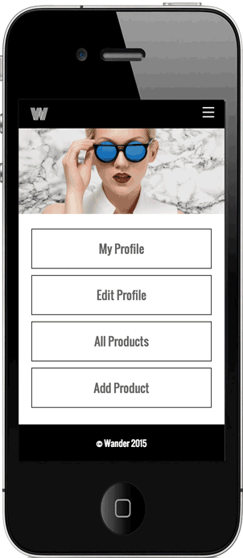
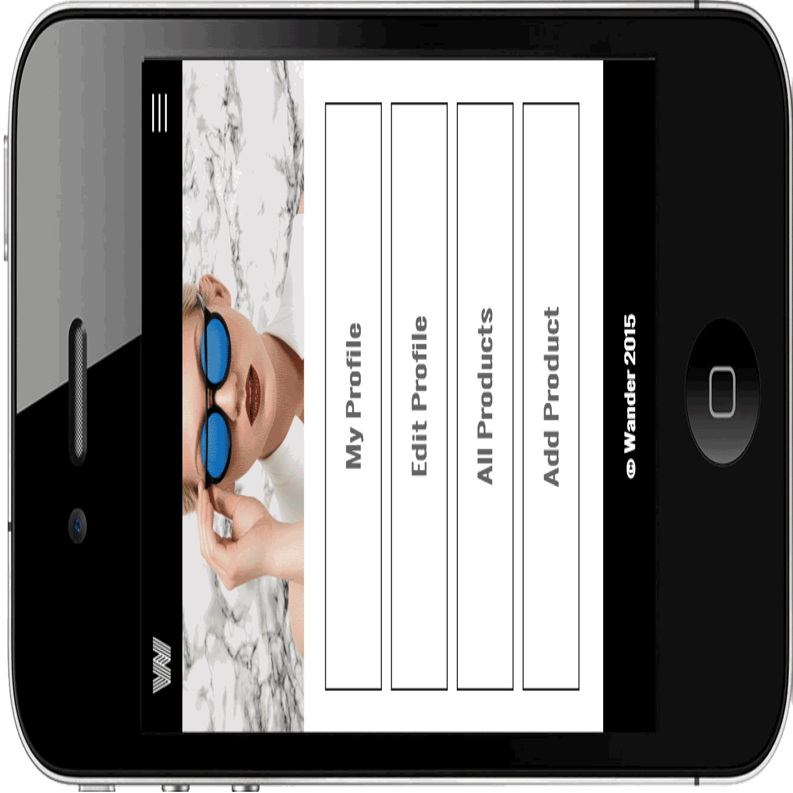

# THE WANDER PORTAL

### GA WDI16 London | Project 2

#### A portal for enabling Sellers on the Wander marketplace to sign up and manage their products on-the-go

##### [Click here](http://bit.ly/wander-portal) to vist the Wander Portal.

##What is *Wander*?
Wander is a contemporary marketplace for emerging fashion and homewares brands in the UK. Unlike most marketplaces, Wander is highly curated with each 'Seller' being hand-picked based on their range, quality and overall brand aesthetic. We do this to ensure that both the young brand's themselves benefit from good company, and our customers benefit from a good shopping experience.

##What's the *problem*?
At peasent, all products are managed by Wander and not the sellers. With the aim of scaling the business, we need to enable Sellers through Wander to manage their own products and personal information.

##The *Wander Portal*

The [Wander Portal](http://bit.ly/wander-portal) to vist the Wander Portal. is the answer to the problem; enabling Sellers to not only sign up and log in, but also upload, edit, delete and view their products - and only their products (i.e. they cannot view or manage other user's products or information).

The portal focusses first and foremost on the mobile experience for the user, keeping in mind these are individuals on the move rather than established businesses with premises. 

##Getting Started

###New User

To experience the portal as a new user ("Seller"):

1. Go to the [Wander Portal](http://bit.ly/wander-portal)
2. Click 'Sign Up' 
3. Complete the form and click "Sign Up"
4. Get started by adding a new product to your collection - either via the homepage quick links, or the My Products dropdown menu.

Once you've added a product, you can view it within All Products (My Producst < All Products). You can also easily update your information, such as your brand's name and description, as well as your email and password via My Profile, simply click Edit to do so.

###Existing User : 'Uncivilised'

To experience the portal as an existing user ("Seller") with multiple products,  we have created a profile for you to view:

1. Go to the [Wander Portal](http://bit.ly/wander-portal)
2. Click 'Log In' 
3. Log in as 'Uncivilised' with the following:

>> uncivilised@uncivilised.com

>> password

## The Build

- HTML5
- CSS / SCSS
- RUBY 
- RAILS
- FOUNDATION 5 
- DEVICE

## Problems & Challenges

I spent a long time planning, which helped me greatly - particularly getting started, however I hadn't expected in the planning stage to require Size as a model. As such, I spent some time removing Size from the Product table and scaffolding separately.

On a similar note, upon deployment I found that checkboxes for Categories and Sizes wouldn't render on Heroku and with no time left was unable to fix - instead, I simply hid from the relative NEW, EDIT and SHOW pages for the time being.

A final area of difficulty was seeding; I was unable to succesfully get the seed working, with a big reason being the Categories and Sizes as well as the user_id properties when creating a new product. Whilst a problem on limited time, it would be merel a challenge that would be overcome in 15 minutes if I had the extra time so I'm not particularly concerned by this.

##"If I had an extra hour..."

In total - and outside of planning - this app was created in 8-9 hours in total. Given an extra couple of days, it would have a dedicated Admin user and Brand user experience, as well as a consumer-facing store (albeit, a very basic one). If I simply had an extra hour however, I would do the following: 

1. Get seed file working
3. Get Category and Sizes checkboxes rendering with Heroku
4. Repolace unsightly flash messages with design-friendly corner notifications
5. Clean up design accents such as buttons on forms
6. Personalise Heroku URL without it buggering the hero images (weird) 